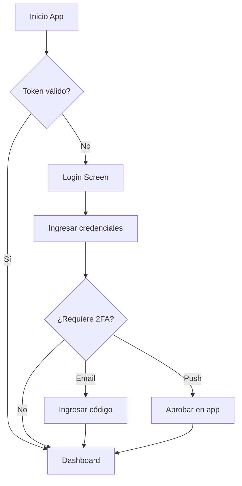

# 🏙️ City Lights Mobile App - Documentación de Login

## 📱 Estructura del Proyecto

```
lib/
├── main.dart                          # Punto de entrada de la aplicación
├── config/
│   ├── theme/
│   │   └── app_theme.dart            # Tema dark mode personalizado
│   └── constants/
│       └── api_constants.dart        # Constantes de API y endpoints
├── core/
│   ├── models/
│   │   ├── user_model.dart           # Modelo de datos de usuario
│   │   └── auth_models.dart          # Modelos de autenticación (requests/responses)
│   └── services/
│       ├── api_service.dart          # Cliente HTTP con Dio
│       ├── auth_service.dart         # Servicio de autenticación
│       └── storage_service.dart      # Almacenamiento seguro
├── providers/
│   └── auth_provider.dart            # Estado global de autenticación
├── screens/
│   └── auth/
│       ├── login_screen.dart         # Pantalla de login
│       └── widgets/
│           ├── custom_text_field.dart # Campo de texto personalizado
│           └── auth_button.dart      # Botón de autenticación
└── widgets/
    └── loading_overlay.dart          # Overlay de carga
```

## 🎨 Características Implementadas

### ✅ Login Screen

- ✨ Diseño UI/UX amigable con tema dark
- 🔐 Validación de formularios en tiempo real
- 📧 Login con email y contraseña
- 🔒 Autenticación de dos factores (2FA)
  - Por email (código de 6 dígitos)
  - Por notificación push (polling con countdown)
- 🎭 Animaciones fluidas (fade & slide)
- 💾 Almacenamiento seguro de tokens
- 📱 Responsive y adaptable
- ⚡ Estado global con Provider
- 🔄 Manejo de errores robusto

### 🎨 Tema Dark Mode

- 🌑 Paleta de colores oscura y moderna
- 🎯 Componentes Material 3
- 💜 Colores principales: Indigo, Purple, Cyan
- 📐 Espaciado y tipografía consistente
- 🎨 Estados visuales (hover, focus, error)

### 🔧 Servicios Core

#### API Service

- 📡 Cliente HTTP basado en Dio
- 🔑 Interceptores para tokens automáticos
- 📝 Logging de requests/responses
- ⚠️ Manejo de errores centralizado
- ⏱️ Timeouts configurables

#### Auth Service

- 🔐 Login/Register/Logout
- ✉️ Verificación de email
- 🔒 2FA (email y push)
- 👤 Gestión de perfil
- 💾 Persistencia de sesión

#### Storage Service

- 🔐 Flutter Secure Storage
- 🔑 Almacenamiento de tokens
- 👤 Cache de datos de usuario
- 📱 Device ID y FCM tokens
- 🧹 Limpieza de datos

## 🚀 Próximos Pasos

### 1. Register Screen

- Formulario de registro
- Validación de contraseña fuerte
- Verificación de email

### 2. Dashboard

- Role-based routing (Admin, Trabajador, Usuario)
- Navegación bottom bar
- Drawer menu

### 3. Áreas Comunes (Booking)

- Lista de áreas comunes
- Calendario de disponibilidad
- Crear/editar reservas
- Aprobar/rechazar reservas (Admin)

### 4. Notificaciones Push

- Firebase Cloud Messaging
- Manejo de notificaciones en foreground/background
- Deep linking desde notificaciones

## 🔐 Configuración Requerida

### 1. Actualizar URL de API

Edita `lib/config/constants/api_constants.dart`:

```dart
// Para desarrollo local con emulador Android
static const String baseUrl = 'http://10.0.2.2:4000';

// Para dispositivo físico en la misma red
static const String baseUrl = 'http://192.168.x.x:4000';

// Para producción
static const String baseUrl = 'https://api.citylights.com';
```

### 2. Firebase Setup (Opcional - para push notifications)

1. Crear proyecto en Firebase Console
2. Descargar `google-services.json` y colocar en `android/app/`
3. Descomentar inicialización en `main.dart`

## 📦 Dependencias Utilizadas

```yaml
dependencies:
  provider: ^6.1.1 # State management
  dio: ^5.4.0 # HTTP client
  flutter_secure_storage: ^9.2.2 # Secure storage
  local_auth: ^3.0.0 # Biometric auth (futuro)
  firebase_core: ^4.2.0 # Firebase (futuro)
  firebase_messaging: ^16.0.3 # Push notifications (futuro)
```

## 🎯 Flujo de Autenticación



## 💡 Tips de Desarrollo

1. **Hot Reload**: Usa `r` en la terminal para hot reload
2. **Hot Restart**: Usa `R` para hot restart
3. **DevTools**: Abre con `flutter devtools` para debugging
4. **Logs**: Los requests/responses se imprimen en consola

## 🐛 Debugging

Para ver logs de API:

- Los requests aparecen con prefijo `📤 REQUEST`
- Las responses con `📥 RESPONSE`
- Los errores con `❌ ERROR`

## 📱 Testing

```bash
# Correr en emulador
flutter run

# Correr en dispositivo físico
flutter run -d <device-id>

# Build release
flutter build apk --release
```

## 🎨 Colores del Theme

```dart
Primary: #6366F1 (Indigo)
Secondary: #8B5CF6 (Purple)
Accent: #06B6D4 (Cyan)
Background: #0A0A0A
Surface: #1A1A1A
Card: #2A2A2A
Success: #10B981
Error: #EF4444
Warning: #F59E0B
```

## 📝 Notas Importantes

1. **Seguridad**: Los tokens se almacenan de forma segura con encryption
2. **Estado**: El provider AuthProvider maneja todo el estado de autenticación
3. **Validación**: Los formularios validan en tiempo real
4. **UX**: Animaciones y transiciones suaves para mejor experiencia
5. **Errores**: Todos los errores de API se muestran como SnackBar

## 🔜 Siguiente Sesión

En la próxima sesión implementaremos:

1. ✅ **Register Screen** - Formulario de registro completo
2. ✅ **Email Verification** - Pantalla de verificación de email
3. ✅ **Dashboard básico** - Estructura principal con navegación

¿Quieres que continúe con alguna de estas características?
